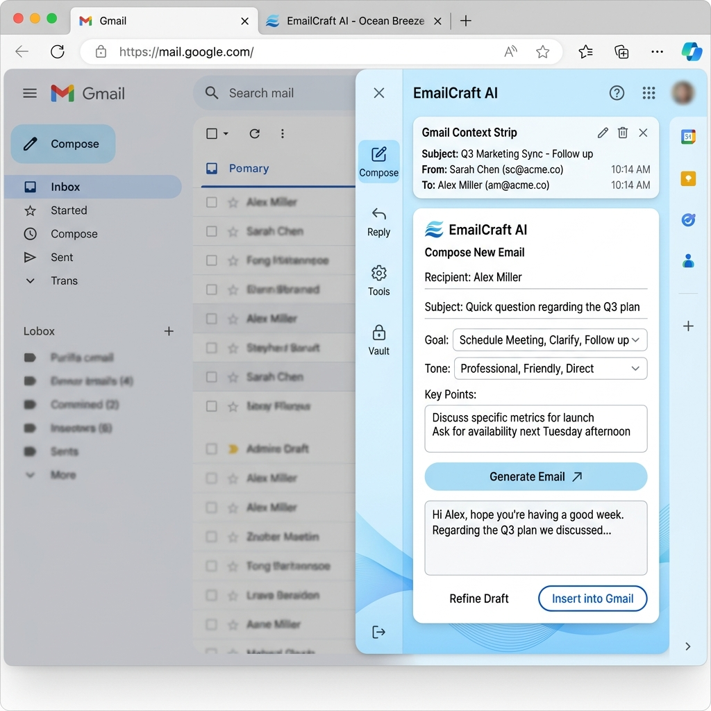
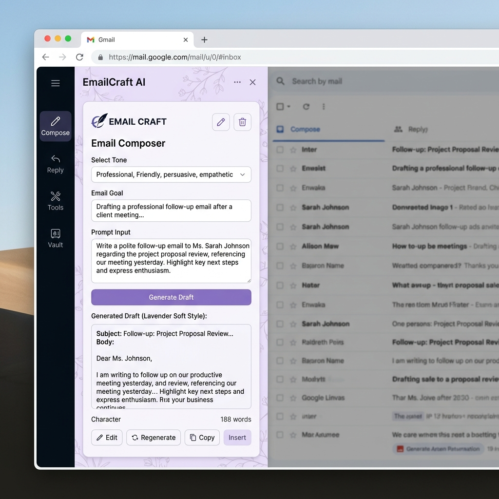
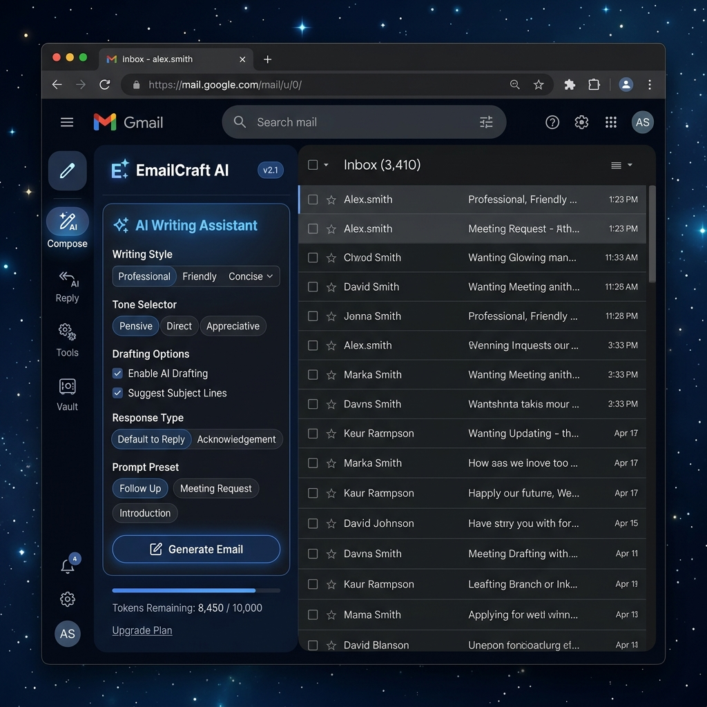
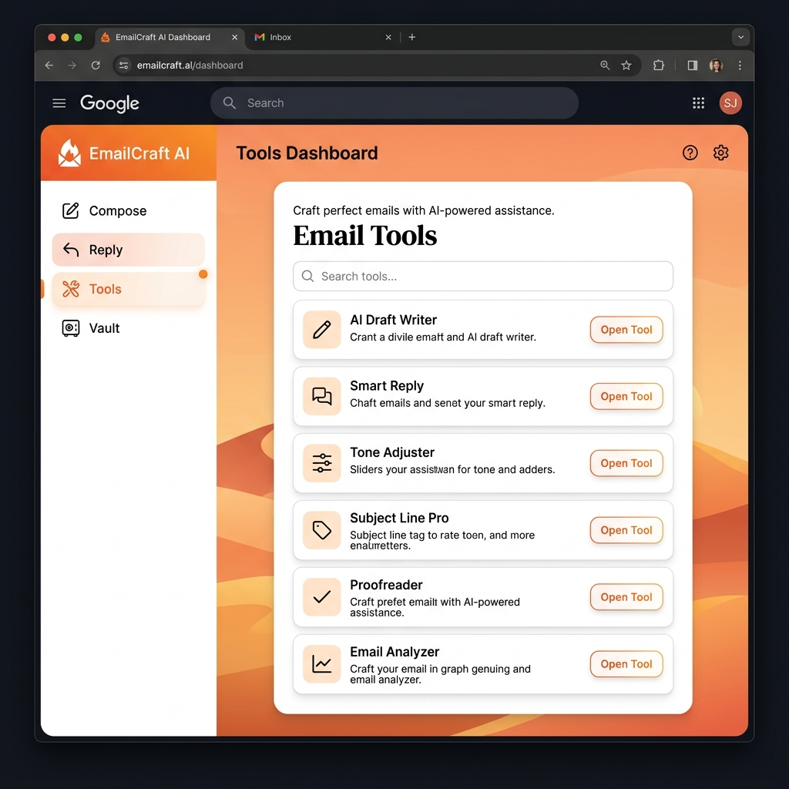

# EmailCraft AI ✦
### Premium AI-Powered Email Productivity Suite

EmailCraft AI is a sophisticated Chrome Extension designed to transform your Gmail experience. By combining a high-end, professional aesthetic with multi-provider AI support, it helps you draft, reply, and analyze emails with unprecedented speed and precision.

---

## 📸 Interface Preview

*Ocean Breeze: A clean, vibrant productivity layout.*

*Lavender Soft: Elegant and focused design for creative writing.*

*Midnight Glow: Deep dark mode for late-night productivity.*

*Warm Sunset: High-contrast, warm aesthetic.*

---

## 🛠 Technology Stack

EmailCraft AI is built with modern web technologies, ensuring performance, security, and a premium feel:

- **Core Structure:** Semantic HTML5 & Vanilla JavaScript (ES6+).
- **Design System:** Custom CSS3 Design System featuring:
  - 5 Dynamic Vector Themes (Lavender, Midnight, Mint, Sunset, Ocean).
  - Variable-based color tokens and responsive layouts.
  - High-fidelity SVG icons and micro-animations.
- **Extension Engine:** Manifest V3 architecture for maximum security and longevity.
- **AI Brain:** Direct integration with major AI providers:
  - **Anthropic:** Claude 3.5 Sonnet / Opus.
  - **Google:** Gemini 2.0 / 1.5.
  - **Groq:** Ultra-fast Llama 3 & Mixtral models.
  - **OpenAI:** GPT-4o / GPT-4o-mini.
- **Data Privacy:** Local-first architecture using `chrome.storage.local`. All API keys and personal data are stored only on your device.

---

## 🔄 Project Workflow

1.  **Context Awareness:** When you open the side panel on a Gmail page, the background worker communicates with a content script to safely extract the subject, sender, and body of the current email thread.
2.  **User Intent:** You select your preferred tone (Professional, Casual, etc.), desired length, and add specific instructions.
3.  **AI Orchestration:** The extension compiles the thread context, user instructions, and your personal style samples into a specialized prompt.
4.  **Secure Processing:** The prompt is sent directly from your browser to your selected AI provider (using your own API key).
5.  **One-Click Injection:** Once generated, you can refine the text or click "Insert" to instantly place the text into the Gmail compose box.

---

## 🗄 RAG (Retrieval-Augmented Generation) & Local Vault

EmailCraft AI implements a "Privacy-First RAG" system through the **Vault**:

- **Personal Knowledge Base:** Save your previous high-performing emails or specific business facts to the Vault.
- **Grounding Data:** When generating emails, the AI can reference these local snippets to match your specific writing style or include accurate company information without you having to re-type it.
- **Zero-Server Storage:** Unlike other AI tools, your RAG data never touches our servers—it lives entirely in your browser's local storage.

---

## 🏗 Architecture

- **Side Panel (`sidepanel.html/css/js`):** The primary UI, featuring a sidebar navigation and a floating content card system. It handles all user interactions and settings.
- **Background Worker (`background.js`):** Orchestrates tab-specific data extraction and ensures the extension remains responsive.
- **Content Script (`content.js`):** The "hands and eyes" of the extension. It reads Gmail's complex DOM and handles the precise insertion of generated text into the `contenteditable` editor.

---

## 🚀 How to Use

### 1. Installation
1. Download this repository.
2. Open Chrome and navigate to `chrome://extensions`.
3. Enable **Developer Mode** (top right).
4. Click **Load unpacked** and select the project folder.

### 2. Configuration
1. Click the **Gear Icon** (⚙) in the top right of the side panel.
2. Select your AI Provider (e.g., Groq or Gemini).
3. Paste your API Key (stored locally).
4. Select your favorite **App Theme**.

### 3. Feature Guide
- **✍ Compose:** Write brand new emails. Type a brief prompt and let the AI do the heavy lifting.
- **↩ Reply:** Analyze the current thread and draft a contextually perfect response.
- **🔧 Tools:**
  - *Summarizer:* Get the TL;DR of long threads.
  - *Commitment Tracker:* Extract action items and deadlines.
  - *Tone Analyzer:* Ensure your email lands exactly as intended.
- **🗂 Vault:** Manage your "Style Samples" to train the AI on your specific voice.

---

## 📝 Examples

- **Scenario:** You need to reply to a complex project update.
- **Action:** Open the **Reply** tab. Select "Professional" tone. Click "Generate".
- **Result:** The AI reads the 5-email thread, acknowledges the sender's last point about the deadline, and confirms you've finished the task.

---
*Created with ❤️ by the EmailCraft AI Team.*
